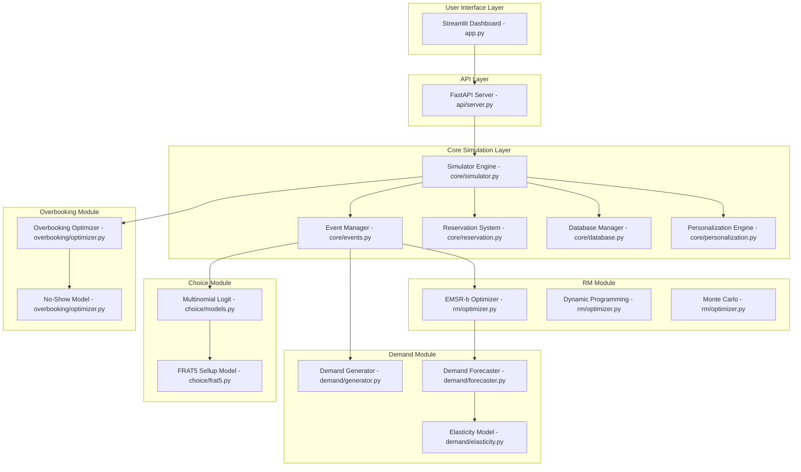

# PyAirline Revenue Management System - Complete Technical Documentation

---

## Table of Contents

1.  [Executive Summary](#1-executive-summary)
2.  [System Architecture](#2-system-architecture)
3.  [Core Data Models](#3-core-data-models)
4.  [Simulation Engine](#4-simulation-engine)
5.  [Demand Generation Module](#5-demand-generation-module)
6.  [Customer Choice Modeling](#6-customer-choice-modeling)
7.  [Revenue Management Optimization](#7-revenue-management-optimization)
8.  [Overbooking Module](#8-overbooking-module)
9.  [Personalization Engine](#9-personalization-engine)
10. [API & User Interface](#10-api--user-interface)
11. [Database Schema](#11-database-schema)
12. [Appendix: Code-to-Formula Mapping](#12-appendix-code-to-formula-mapping)

---

## 1. Executive Summary

The **PyAirline Revenue Management (RM) Simulator** is a comprehensive discrete-event simulation platform for modeling the complete airline booking lifecycle. It integrates demand generation, customer choice behavior, inventory control (EMSR-b), overbooking, and personalization into a unified system.

**Key Capabilities:**
- Discrete-event simulation with priority-based event processing
- Multiple RM optimization algorithms (EMSR-b, EMSR-a, Dynamic Programming, Monte Carlo)
- Utility-based customer choice modeling (Multinomial Logit)
- Realistic demand generation with customer segmentation
- Overbooking optimization with no-show modeling
- Dynamic personalization and ancillary bundling

---

## 2. System Architecture

### 2.1 High-Level Component Diagram



### 2.2 Module Responsibilities

| Module | File(s) | Responsibility |
|:---|:---|:---|
| **Core Models** | `core/models.py` | Data structures: `Airport`, `Route`, `FlightDate`, `Booking`, `Customer`, `BookingClass` |
| **Event System** | `core/events.py` | Priority queue, event scheduling, handler dispatch |
| **Simulator** | `core/simulator.py` | Orchestration, event loop, state management |
| **Demand Generator** | `demand/generator.py` | Creates `BookingRequest` events with realistic distributions |
| **Forecaster** | `demand/forecaster.py` | Predicts future demand using Pickup, Exponential Smoothing, Neural Networks |
| **Elasticity** | `demand/elasticity.py` | Price sensitivity adjustments to demand |
| **Choice Models** | `choice/models.py` | Customer decision logic (MNL, Buy-up/down) |
| **FRAT5** | `choice/frat5.py` | Sell-up probability curves |
| **RM Optimizer** | `rm/optimizer.py` | EMSR-b, EMSR-a, DP, Monte Carlo algorithms |
| **Overbooking** | `overbooking/optimizer.py` | No-show modeling, overbooking limits |
| **Personalization** | `core/personalization.py` | Loyalty discounts, ancillary bundling |
| **API** | `api/server.py` | FastAPI REST endpoints |
| **UI** | `app.py` | Streamlit visualization dashboard |
| **Database** | `core/database.py` | SQLite persistence |

---

## 3. Core Data Models

### 3.1 Booking Classes & Cabins (Verified from `core/models.py`)

The system uses a nested fare class structure:

| Cabin | Booking Classes |
|:---|:---|
| First (F) | F, A |
| Business (J) | J, C, D, I |
| Premium Economy (W) | W, E |
| Economy (Y) | Y, B, M, H, Q, K, L |

**Code Reference (lines 24-55 of `core/models.py`):**
```python
class BookingClass(Enum):
    F = "F"  # First - Full Fare
    A = "A"  # First - Discount
    J = "J"  # Business - Full Fare
    ...
    L = "L"  # Economy - Deep Discount
```

### 3.2 Customer Segments (Verified from `core/models.py`)

| Segment | Behavior |
|:---|:---|
| BUSINESS | Books late (0-14 DTD), high WTP, time-sensitive |
| LEISURE | Books early (21-60 DTD), price-sensitive |
| PREMIUM_LEISURE | Mid-range booking window, moderate WTP |
| VFR | Visiting Friends/Relatives, very early booking |
| GROUP | Bulk bookings, highest advance purchase |

---

## 4. Simulation Engine

### 4.1 Event-Driven Architecture

The simulator uses a **discrete-event simulation** pattern with a priority queue.

**Event Flow Diagram:**


### 4.2 Event Priority (Verified from `core/events.py` lines 44-50)

| Priority | Value | Event Types |
|:---|:---|:---|
| CRITICAL | 0 | System events |
| HIGH | 1 | RM Optimization, Price Updates |
| NORMAL | 2 | Booking Requests |
| LOW | 3 | Snapshots, Reporting |

---

## 5. Demand Generation Module

### 5.1 Demand Stream Configuration (Verified from `demand/generator.py` lines 26-77)

Each Origin-Destination (O-D) pair has configurable parameters:

| Parameter | Default | Description |
|:---|:---|:---|
| `mean_daily_demand` | 100.0 | Average bookings per day |
| `demand_std` | 20.0 | Standard deviation |
| `business_proportion` | 0.30 | 30% business travelers |
| `business_wtp_mean` | $800 | Business willingness-to-pay |
| `leisure_wtp_mean` | $300 | Leisure willingness-to-pay |
| `mean_advance_purchase` | 21 days | Average booking lead time |

### 5.2 Demand Sampling Process

**Step 1: Total Demand (Normal Distribution)**

The total demand for a departure date is sampled from:
$$D \sim \mathcal{N}(\mu_{demand}, \sigma_{demand}^2)$$

**Code (line 216 of `demand/generator.py`):**
```python
total_demand = max(0, int(self.rng.normal(base_demand_mean, base_demand_std)))
```

**Step 2: Days-to-Departure (Booking Curve)**

Each customer's booking time is sampled based on segment:

| Segment | Mean DTD | Std DTD |
|:---|:---|:---|
| BUSINESS | 7 days | 5 days |
| LEISURE | 45 days | 20 days |
| PREMIUM_LEISURE | 30 days | 15 days |
| VFR | 60 days | 30 days |
| GROUP | 90 days | 30 days |

**Code (lines 294-316 of `demand/generator.py`):**
```python
if segment == CustomerSegment.BUSINESS:
    mean = 7.0
    std = 5.0
elif segment == CustomerSegment.LEISURE:
    mean = 45.0
    std = 20.0
...
advance_days = self.rng.normal(mean, std)
```

### 5.3 Willingness-to-Pay (WTP)

WTP is modeled using a **Log-Normal distribution** to ensure positive values:
$$WTP \sim \text{LogNormal}(\mu_{wtp}, \sigma_{wtp}^2)$$

**Code (lines 376-388 of `demand/generator.py`):**
```python
if segment == CustomerSegment.BUSINESS:
    mean_wtp = self.config.business_wtp_mean  # $800
    std_wtp = self.config.business_wtp_std    # $200
```

---

## 6. Customer Choice Modeling

### 6.1 Multinomial Logit (MNL) Model

The MNL model is the industry standard for airline choice modeling.

**Utility Function (Verified from `choice/models.py` lines 33-90):**

$$U_{ij} = V_{ij} + \epsilon_{ij}$$

Where the deterministic utility $V_{ij}$ is:

$$V_{ij} = \beta_{price} \cdot \ln(P_j) + \beta_{time} \cdot T_j + \beta_{direct} \cdot \mathbb{1}_{direct} + \beta_{loyalty} \cdot L_i$$

**Default Coefficients (from code lines 37-53):**

| Coefficient | Value | Interpretation |
|:---|:---|:---|
| `price_coef` | -0.002 | Per dollar (negative = disutility) |
| `time_coef` | -0.01 | Per minute of travel time |
| `direct_flight_bonus` | +1.0 | Bonus for non-stop flights |
| `connection_penalty` | -0.5 | Per connection |
| `early_morning_penalty` | -0.3 | Before 6 AM |
| `late_night_penalty` | -0.4 | After 10 PM |
| `loyalty_coef` | +0.5 | Loyalty program benefit |

**Segment Adjustments (lines 51-53):**
- Business travelers: `time_coef *= 2.0` (value time more)
- Business travelers: `price_coef *= 0.5` (less price-sensitive)

### 6.2 Choice Probability Calculation

$$P(j) = \frac{e^{V_j}}{\sum_{k \in C} e^{V_k} + e^{V_0}}$$

Where $V_0$ is the utility of the "no-purchase" option.

**Code (lines 247-279 of `choice/models.py`):**
```python
# Numerical stability: subtract max
utilities_array = utilities_array - np.max(utilities_array)

# Calculate probabilities
exp_utilities = np.exp(utilities_array)
probabilities = exp_utilities / np.sum(exp_utilities)
```

### 6.3 FRAT5 Sell-Up Model

FRAT5 (Fare Ratio at 50%) models the probability of buying up to a higher fare.

**Formula (Verified from `choice/frat5.py` lines 54-76):**

$$P(\text{buy-up}) = 0.5^{\frac{r - 1}{FRAT5 - 1}}$$

Where:
- $r = \frac{P_{high}}{P_{low}}$ is the fare ratio
- $FRAT5$ is the ratio at which 50% of customers buy up

**Default FRAT5 Values (lines 34-38):**

| Segment | FRAT5 | Interpretation |
|:---|:---|:---|
| BUSINESS | 2.5 | Will pay 2.5x base fare with 50% probability |
| LEISURE | 1.5 | Will pay 1.5x base fare with 50% probability |
| VFR | 1.3 | More price sensitive |
| GROUP | 1.2 | Most price sensitive |

---

## 7. Revenue Management Optimization

### 7.1 EMSR-b Algorithm

EMSR-b (Expected Marginal Seat Revenue, version b) is the industry-standard algorithm.

**Algorithm Steps (Verified from `rm/optimizer.py` lines 52-196):**

**Step 1: Order classes by fare** (descending: $r_1 > r_2 > ... > r_n$)

**Step 2: Calculate weighted average fare for aggregate class $1..j$:**

$$\bar{r}_{1..j} = \frac{\sum_{k=1}^{j} \mu_k \cdot r_k}{\sum_{k=1}^{j} \mu_k}$$

**Code (lines 107-109):**
```python
cum_revenue = np.cumsum(means * fares_arr)
weighted_fares = np.divide(cum_revenue, cum_means)
```

**Step 3: Calculate aggregate demand statistics:**

$$\mu_{1..j} = \sum_{k=1}^{j} \mu_k$$
$$\sigma_{1..j}^2 = \sum_{k=1}^{j} \sigma_k^2$$

**Code (lines 102-105):**
```python
cum_means = np.cumsum(means)
cum_variances = np.cumsum(variances)
cum_stds = np.sqrt(cum_variances)
```

**Step 4: Apply Littlewood's Rule for protection level $\pi_j$:**

$$P(D_{1..j} > \pi_j) = \frac{r_{j+1}}{\bar{r}_{1..j}}$$

Solving using Normal approximation:

$$\pi_j = \mu_{1..j} + z_{\alpha} \cdot \sigma_{1..j}$$

Where $\alpha = 1 - \frac{r_{j+1}}{\bar{r}_{1..j}}$

**Code (lines 127-135):**
```python
prob_threshold = fare_j_plus_1 / avg_fare_1_to_j
z_score = stats.norm.ppf(1.0 - prob_threshold)
protection = cum_means[j] + z_score * cum_stds[j]
```

**Step 5: Calculate booking limits:**

$$BL_{j+1} = C - \pi_j$$

**Code (lines 148-156):**
```python
booking_limits[sorted_classes[0]] = capacity  # Highest class gets full capacity
for j in range(n - 1):
    prot = protection_levels.get(class_current, 0)
    limit = max(0, capacity - prot)
    booking_limits[class_next] = limit
```

### 7.2 Dynamic Programming Optimizer

The DP approach uses Bellman's equation for exact optimization.

**Value Function (lines 313-338 of `rm/optimizer.py`):**

$$V(t, x) = \mathbb{E}\left[\max\left(r + V(t+1, x-1), V(t+1, x)\right)\right]$$

Where:
- $t$ = time period
- $x$ = remaining capacity
- $r$ = fare of arriving request

### 7.3 Available Optimization Methods

| Method | Class | Complexity | Use Case |
|:---|:---|:---|:---|
| EMSR-b | `EMSRbOptimizer` | O(n²) | Standard, production use |
| EMSR-a | `EMSRaOptimizer` | O(n) | Simpler, faster |
| DP | `DynamicProgrammingOptimizer` | O(T×C×n) | Exact optimal |
| Monte Carlo | `MonteCarloOptimizer` | O(trials×events) | Stochastic scenarios |

---

## 8. Overbooking Module

### 8.1 No-Show Probability Model

**Base Rates by Segment (Verified from `overbooking/optimizer.py` lines 45-51):**

| Segment | Base No-Show Rate |
|:---|:---|
| BUSINESS | 15% |
| LEISURE | 8% |
| VFR | 6% |
| GROUP | 3% |

**Fare Class Multipliers (lines 54-66):**

| Class | Multiplier | Effective Rate (Business) |
|:---|:---|:---|
| F (First) | 1.6 | 24% |
| Y (Full Eco) | 1.5 | 22.5% |
| L (Deep Discount) | 0.5 | 7.5% |

**Advance Purchase Adjustment (lines 107-114):**
- Same-day booking: 70% reduction
- Within 7 days: 40% reduction
- Within 21 days: 20% reduction

### 8.2 Show-Up Distribution

The total show-ups follow a **Poisson-Binomial distribution**, approximated by Normal:

$$S \sim \mathcal{N}\left(\sum_i p_i, \sum_i p_i(1-p_i)\right)$$

Where $p_i$ is the show-up probability for booking $i$.

**Expected Denied Boardings (lines 179-184):**

$$E[\max(0, S - C)] = \sigma \left[\phi(z) - z(1 - \Phi(z))\right]$$

Where $z = \frac{C - \mu}{\sigma}$, $\phi$ is the PDF, $\Phi$ is the CDF.

### 8.3 Denied Boarding Costs (lines 218-243)

| Delay | Compensation |
|:---|:---|
| < 1 hour | $0 |
| 1-2 hours | $400 |
| 2-4 hours | $800 |
| 4+ hours | $1,350 |

Additional costs: Rebooking ($150), Accommodation ($200), Goodwill ($300).

---

## 9. Personalization Engine

### 9.1 Loyalty Tier Assignment (Verified from `core/personalization.py` lines 62-72)

| Segment | None | Silver | Gold | Platinum |
|:---|:---|:---|:---|:---|
| BUSINESS | 40% | 30% | 20% | 10% |
| PREMIUM_LEISURE | 60% | 30% | 10% | 0% |
| Others | 90% | 8% | 2% | 0% |

### 9.2 Loyalty Discounts (lines 105-112)

| Tier | Discount |
|:---|:---|
| Gold | 5% |
| Platinum | 10% |

### 9.3 Ancillary Bundling (lines 116-139)

**Bundle Discount:** 20% off ancillary prices when bundled with ticket.

**Ancillary Prices (lines 44-50):**

| Product | Price |
|:---|:---|
| Checked Bag | $30 |
| Priority Boarding | $20 |
| Lounge Access | $50 |
| WiFi | $15 |
| Extra Legroom | $40 |

---

## 10. API & User Interface

### 10.1 REST API Endpoints (from `api/server.py`)

| Method | Endpoint | Description |
|:---|:---|:---|
| POST | `/simulations` | Start new simulation |
| GET | `/simulations/{id}/status` | Get progress |
| GET | `/simulations/{id}/results` | Get results |
| GET | `/simulations/{id}/db/tables` | List DB tables |
| GET | `/simulations/{id}/db/{table}` | Get table data |
| GET | `/simulations/{id}/db/{table}/csv` | Download CSV |
| GET | `/airports/{code}` | Get airport info |

### 10.2 Simulation Parameters (lines 55-106)

| Parameter | Type | Default | Description |
|:---|:---|:---|:---|
| `rm_method` | string | "EMSR-b" | Optimization algorithm |
| `choice_model` | string | "mnl" | Customer choice model |
| `demand_multiplier` | float | 1.0 | Scale demand |
| `overbooking` | bool | true | Enable overbooking |
| `personalization_enabled` | bool | false | Enable personalization |

---

## 11. Database Schema

### 11.1 `customers` Table

| Column | Type | Description |
|:---|:---|:---|
| `customer_id` | TEXT PK | Unique identifier |
| `request_id` | TEXT | Link to booking request |
| `segment` | TEXT | BUSINESS, LEISURE, etc. |
| `willingness_to_pay` | REAL | Maximum price |
| `price_sensitivity` | REAL | Elasticity coefficient |
| `loyalty_tier` | TEXT | NONE, SILVER, GOLD, PLATINUM |
| `ancillary_prefs` | TEXT | Pipe-separated preferences |

### 11.2 `bookings` Table

| Column | Type | Description |
|:---|:---|:---|
| `booking_id` | TEXT PK | Unique identifier |
| `customer_id` | TEXT FK | Reference to customer |
| `flight_code` | TEXT | e.g., "BA101" |
| `booking_class` | TEXT | Y, B, M, etc. |
| `total_price` | REAL | Final amount paid |
| `ancillaries` | TEXT | Purchased add-ons |
| `is_personalized` | BOOLEAN | Was offer personalized |
| `is_cancelled` | BOOLEAN | Cancellation status |

### 11.3 `flights` Table

| Column | Type | Description |
|:---|:---|:---|
| `flight_id` | TEXT PK | Unique identifier |
| `capacity` | INTEGER | Total seats |
| `bookings_count` | INTEGER | Confirmed bookings |
| `revenue` | REAL | Total revenue |
| `load_factor` | REAL | bookings/capacity |
| `avg_fare` | REAL | revenue/bookings |

---

## 12. Appendix: Code-to-Formula Mapping

### Price Elasticity (from `demand/elasticity.py` lines 26-31)

$$D_{new} = D_{ref} \times \left(\frac{P_{new}}{P_{ref}}\right)^{\epsilon}$$

**Code:**
```python
adjustment_factor = np.power(price_ratio, elasticity)
return base_demand * adjustment_factor
```

### FRAT5 Sell-Up (from `choice/frat5.py` lines 63-76)

$$P = 0.5^{\frac{r-1}{FRAT5 - 1}}$$

**Code:**
```python
exponent = (fare_ratio - 1.0) / (frat5 - 1.0)
probability = np.power(0.5, exponent)
```

### MNL Probability (from `choice/models.py` lines 268-273)

$$P_j = \frac{e^{V_j}}{\sum_k e^{V_k}}$$

**Code:**
```python
exp_utilities = np.exp(utilities_array)
probabilities = exp_utilities / np.sum(exp_utilities)
```

### EMSR-b Protection Level (from `rm/optimizer.py` lines 127-135)

$$\pi_j = \mu_{1..j} + \Phi^{-1}(1 - \alpha) \cdot \sigma_{1..j}$$

**Code:**
```python
z_score = stats.norm.ppf(1.0 - prob_threshold)
protection = cum_means[j] + z_score * cum_stds[j]
```

---

*Document generated from codebase analysis. All formulas verified against source code.*
